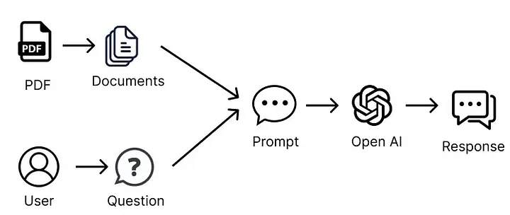
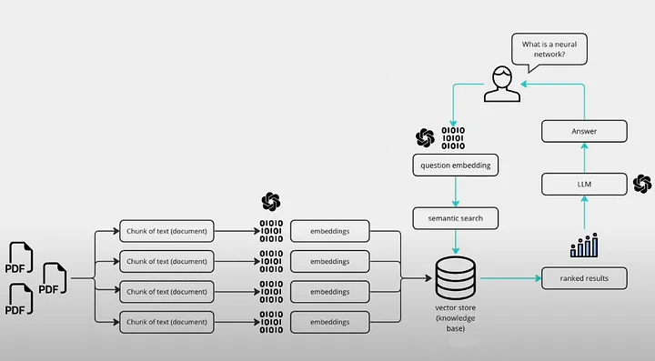

# PDF Chat using RAG

### Finding proper answer from PDF content.

PDF documents often contain numerous pages, making it time-consuming for users to locate specific answers to their questions. 

This project aims to develop a chatbot capable of interacting with users and providing precise answers from a collection of PDF documents. By leveraging natural language processing and machine learning techniques, the chatbot can comprehend user queries and retrieve relevant information efficiently. Utilizing OpenAI models, the chatbot harnesses advanced language models and embeddings to enhance conversational capabilities and deliver accurate responses.

## Features

- **Support for Multiple PDFs**: Users can upload and query information from multiple PDF documents, enabling access to a variety of sources.  
- **Conversational Retrieval**: The chatbot employs advanced conversational retrieval techniques to deliver relevant, context-aware responses.  
- **Integration of Language Models**: OpenAI's language models are utilized for natural language understanding and generation, allowing the chatbot to engage in meaningful interactions.  
- **PDF Content Extraction**: Text content is extracted from uploaded PDFs, forming the basis for indexing and retrieval.  
- **Text Chunking for Efficiency**: The extracted text is divided into smaller chunks, enhancing retrieval efficiency and ensuring precise answers.  

## Usage

- **Upload PDF Files**: Utilize the sidebar to upload one or more PDF documents to the application.  
- **Ask Your Questions**: Enter questions in the main chat interface related to the content of the uploaded PDFs.  
- **Get Answers**: The chatbot will provide responses based on the information extracted from the PDFs.  

## Sample Output


### WorkFlow


### Query Flow



## Installation

To install and run the app, follow these steps:

Clone the repository 

```
git clone https://github.com/codemaker2015/pdf-chat-using-RAG
```

Add your OpenAI Key by creating a .env file in the folder and add the following within it:

```
OPENAI_API_KEY=
OPENAI_MODEL_NAME=gpt-3.5-turbo
OPENAI_EMBEDDING_MODEL_NAME=text-embedding-3-small
```

Create a Virtual Environment

```
pip install virtualenv
```

to run this app do activate environment and run app

```
python -m venv venv
source venv/bin/activate #for ubuntu
venv/Scripts/activate #for windows
```

Install the dependencies using requirements.txt

```bash
pip install -r requirements.txt
```

```
streamlit run app.py
```


